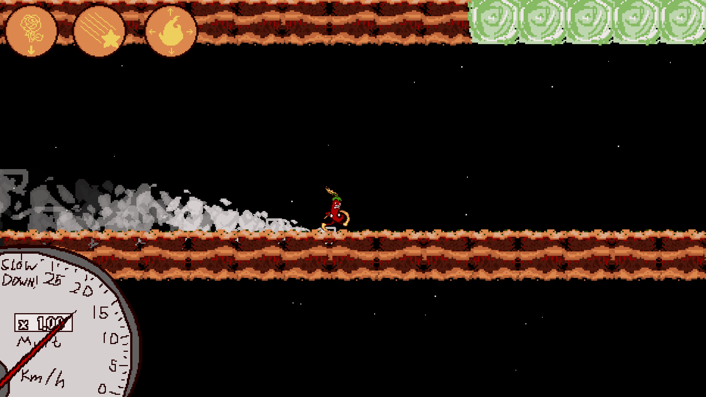
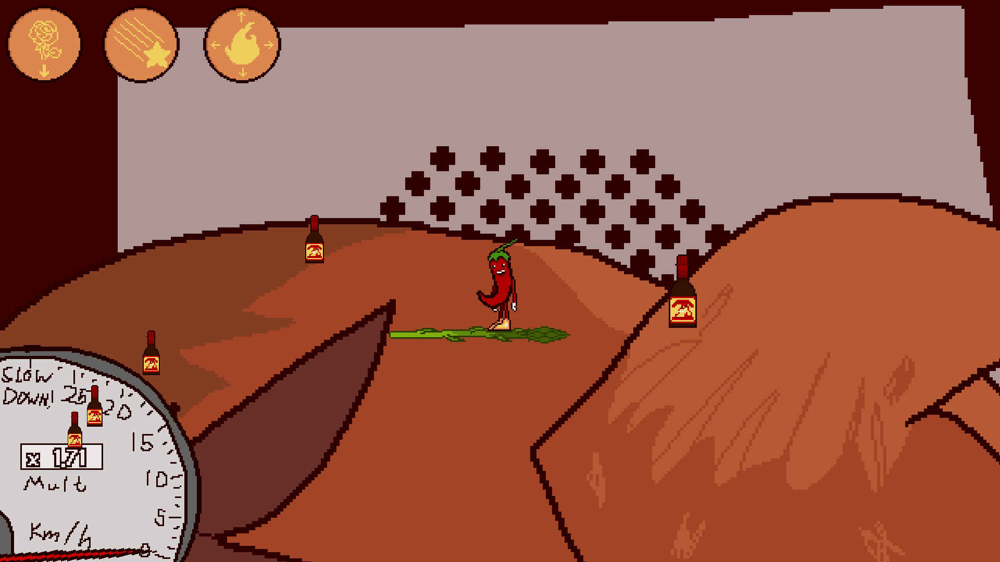
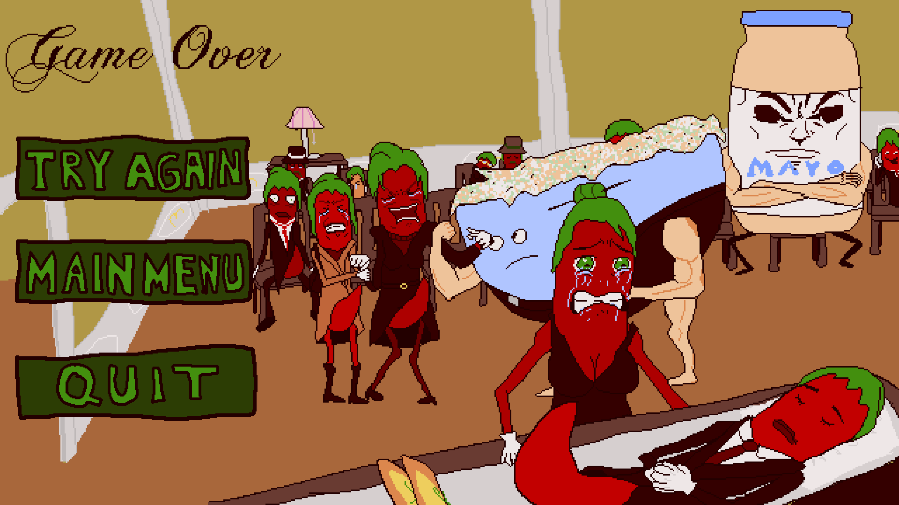
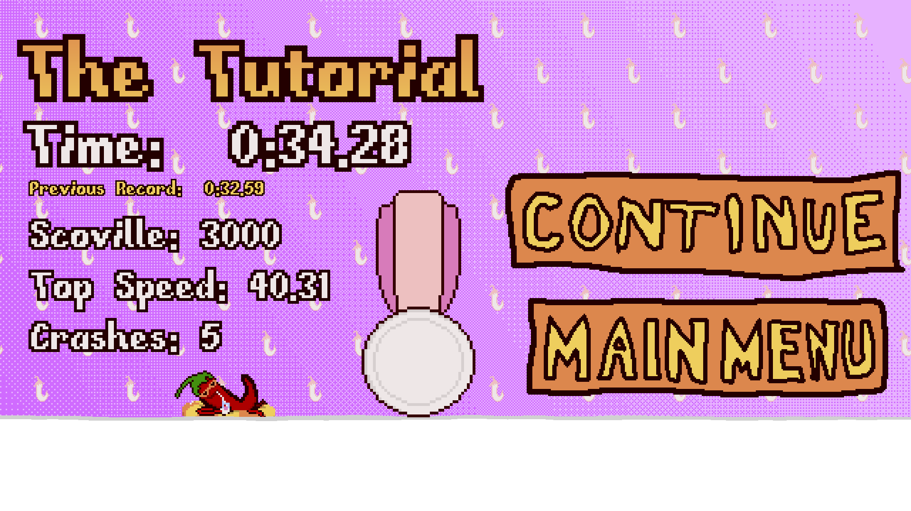

# No Chilli

No Chilli is a fast-paced platformer. You play as Chiliman, who is being chased by a giant determined to eat him. Run fast, bounce off walls, and perform expert turns to evade him and reach the glass of milk! 

The game is intended to be simply a side-project and meant to be a fun tool to sharpen my development skills.

---

## Features
- Tutorial level included
- One playable level
- Earn medals based on completion time
- A pretty fun moveset

---

## Built with GameMaker Studio 2
- Exe file present in the No Chilli 1.1 rar

---

## Screenshots

*Game Over screen*

*Win screen*

